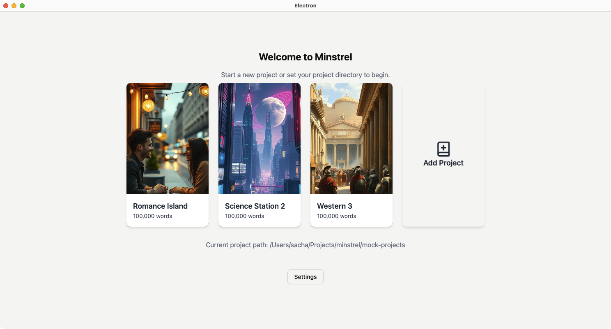
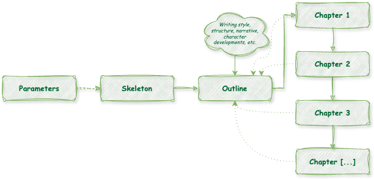
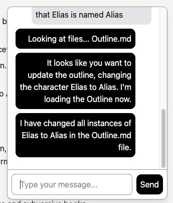

# Minstrel

**Writer's block sucks. Let's solve it.** Minstrel is an application designed to bring collaborative writing to the fiction world, and save writers from staring at blank pages. It helps you develop a story structure, simplifies world-building, keeps consistency, guides you through the writing process, and gives helpful suggestions. It's like having a friend next to you taking notes, listening to your ideas, and helping you get unstuck.

**Write as much or as little as you like.** Minstrel doesn't take control of your writing, it builds on your creativity. Define your story, flesh out your characters, establish narrative and rhythm, write your own chapters. It'll be there to help if you need it, tracking the storyline so far and identifying areas for improvement.

## Features

- 🤖 **Guided world-building:** Build your story from ideation to outlines and chapters, with AI assistance at each stage.
* 💬 **Familiar chat interface:** All interactions take place through a familiar chat window. Ask Minstrel questions, give it instructions, strategize on next steps. It's your writing buddy.
- 🤹 **Multi-agent architecture:** Specialized agents (Project Managers, Writers, Critics, Storyline Specialists) work behind the scenes to get the best output. It's like having a whole team.
- ✍️ **Iterative process:** Revisit and refine any part of the story, including skeletons and outlines. Restructure entire chapters, or just add and remove details.
- 🔑 **Use your own key:** Minstrel is free to use, just provide your own API key. Currently, Minstrel uses the free (rate-limited) Gemini Flash 2.0 API.

# Writing a Novel with Minstrel

Minstrel follows a structured process to guide users through the writing experience, but *does not take control*. It is intended to allow writers to give as much input as they like, and let the AI model do the rest. Writing style, changes you make to the story, additions, and writing style are all up to you. If you like, **the entire story can be written by you**, the AI is just there to help.

#### The following is a step-by-step guide to writing a novel with Minstrel:

- Open Minstrel and select the "Add Project" option.
- Minstrel will ask you some basic questions about your project, such as the name, genre, and storyline details you have in mind.
- From those parameters, Minstrel will automatically generate a broad-strokes **Skeleton** for your story. A skeleton is a basic suggested structure with characters, chapters, and environments described in abstract. Change the Skeleton as much as you like — add or remove details, characters, names, chapters, or storyline events.

- From the Skeleton, ask Minstrel to generate a story **Outline**.  The Outline is a more detailed version of the Skeleton, with specific details about the characters, their relationships, and the events that will happen in the story. Environments are described visually, and chapters are broken down into scenes. Again, you may change the Outline as you like - the editing process is totally yours. Minstrel can also help you change the Outline and provide feedback. Try prompts like "Where could we add some foreshadowing for the climax?" or "In the Outline, let's have the main characters meet in Chapter 4 instead of Chapter 5."
- Minstrel can then generate **Chapters** based on the outline, or you can write them yourself. Each time you write a chapter, the full outline and previous chapter are passed to the AI to maintain consistency. Writing style, character appearances, and environments are all respected. Edits can be done by hand, or you can give Minstrel directions like "In Chapter 4, let's start Arthur outisde of his house rather than in the living room." or "Have the ship commander check for survivors before pursuing the aliens."
- Updates made to chapters can then be syndicated back to the Outline. Try "Update the outline to reflect the new changes in Chapter 8" — soon this will happen automatically, but for the first version of Minstrel, you should actively instruct the AI to do it.

All story files (Skeleton, Outline, Chapters) are written in Markdown and saved as plain text, so you aren't locked into a proprietary file format. Edit them the same you would any other text file, from any other program. Go nuts!

#### Other Features coming soon:

- **Project Analytics:** Track chapter-by-chapter word counts, daily streaks, and other project metrics. Stay on top of your writing progress.
- **Automatic outline updates:** Minstrel will automatically update your outline as you write chapters, flagging you to revisit or update sections as needed.
- **Import/Export:** Export your story files to Word, PDF, or other formats.
- **Diff-based editing:** See the changes Minstrel is making to your story files and review them before applying.

## Technologies Used

Minstrel is built on Electron, React, Vite, Typescript, TailwindCSS, ShadCN UI, Lucide React, Recharts, ThreeJS, and MDXEditor. It is a bleeding-edge project using React V19, Tailwind V4, and ShadCN so it's technically not production-ready yet. As of February 2025, most of these packages are still in flux and adjusting to the React 19 transition, so expect some rough edges.

Other technologies used include:
- **State Management:** Redux
- **AI Model:** Gemini API
- **Language:** TypeScript

## System Requirements

- Minstrel is built with Node.js and requires Node.js 18 or higher to run.
- Minstrel is currently only tested and supported on MacOS with Apple Silicon.
- It may work on other platforms with some tweaking, but it's not guaranteed. Project reading/saving is likely to fail. Look into fileOps.ts for more details.
- If you create a Windows-compatible fork, please submit a pull request!

## Getting Started

To run Minstrel locally:
1.  Clone the repository.
2.  Install dependencies using `npm install`.
4.  Run the application using `npm run dev`.
3.  Obtain an API key for the Gemini API and set it in the application settings.
4.  Optional: Set your project directory. If you'd like to use mocks, they've been provided in the mock-projects folder.

# Development

## Contributions

Minstrel is open to contributions. If you'd like to develop a new feature or fix a bug, please submit a pull request. For major changes, please open an issue first or reach out to me directly to discuss the proposed changes.

## Memory Bank

Forking the project? Using an AI-enabled LLM? This project is set up with a Cline-compatible Memory Bank to maintain development context. The Memory Bank consists of the following core files:

- `projectBrief.md`: Defines the project's core requirements and goals. Should not be modified by the LLM, only the user.
- `productContext.md`: Descries the project's overall purpose, problems it solves, and user experience goals.
- `techContext.md`: Contains system architecture, technologies used, development setup, and dependencies.
- `progress.md`: Outlines the phased development plan and progress.
- `activeContext.md`: Tracks the current work focus and development status.

## License

MIT License

Permission is hereby granted, free of charge, to any person obtaining a copy
of this software and associated documentation files (the "Software"), to deal
in the Software without restriction, including without limitation the rights
to use, copy, modify, merge, publish, distribute, sublicense, and/or sell
copies of the Software, and to permit persons to whom the Software is
furnished to do so, subject to the following conditions:

Portions of Minstrel may end up commercial, but it's intended that the base source code will always remain free/gratis. It's yours, y'all. Do what you want with it. Just don't sue me.
