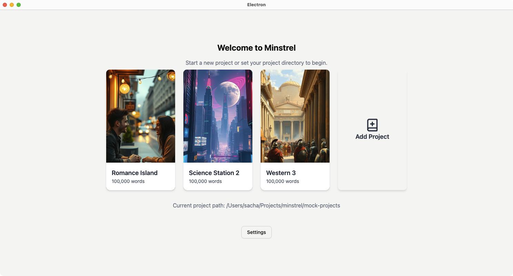

# Minstrel

  An AI-assisted desktop writing studio for novelists, fan fiction writers, and other long-form storytellers.

  
  
  
  

Minstrel is a writing tool built to help fiction writers keep moving when momentum drops.

It is designed around the parts of the process that usually stall out: ideation, chapter drafting, story analysis, and keeping the voice of the work coherent as the manuscript grows.

## Why It Exists

Docs apps are good at storing words. Minstrel aims to be useful while you are still figuring out what to write next.

The project is built around a simple goal: reduce writer's block without turning the work into generic AI output.

## Current Focus

- Guided ideation when a draft or outline starts to stall
- Story-aware assistance that works against the current project, not an empty prompt box
- Style and continuity support while chapters, notes, and artifacts evolve
- A desktop-first workspace for long-form projects

## Highlights

- Chat-based writing assistance with streamed responses and suggested next actions
- Project workspace with recent projects, chapter navigation, and manuscript artifacts
- Rich-text writing environment powered by Lexical
- Local project storage with SQLite-backed app data and file-based project operations
- Cover selection and PDF export for packaging a manuscript
- In-app model/provider settings with API key validation

## Built With

- Electron
- React 19
- TypeScript
- Vite and `electron-vite`
- Lexical
- Redux Toolkit
- better-sqlite3
- Vercel AI SDK with Google and OpenAI provider support currently implemented
- Vitest and GitHub Actions

## Using AI Features

Minstrel uses user-supplied API keys configured inside the app's Settings screen.

- Select an AI provider (Google or OpenAI)
- Paste your API key
- Choose preferred models for higher- and lower-cost tasks

## Langfuse Tracing

Agent traces can be exported to Langfuse Cloud from the Electron main process.

1. Copy `.env.example` to `.env`
2. Fill in `LANGFUSE_BASE_URL`, `LANGFUSE_PUBLIC_KEY`, and `LANGFUSE_SECRET_KEY`
3. Start the app normally with `npm run dev`

The Langfuse secret key is loaded only in the Electron main process and is not exposed to the renderer.

## Licensing

The application is licensed under the Creative Commons Attribution-NonCommercial 4.0 International (CC BY-NC 4.0) license. This means that you are free to share and adapt the application for non-commercial purposes, as long as you give appropriate credit and indicate if changes were made. Commercial use is not permitted under this license.

Specific components or utility functions within the project are licensed under the MIT license. This allows for more permissive use, including commercial use, of these specific parts of the code. See the source code of individual files for license information.

